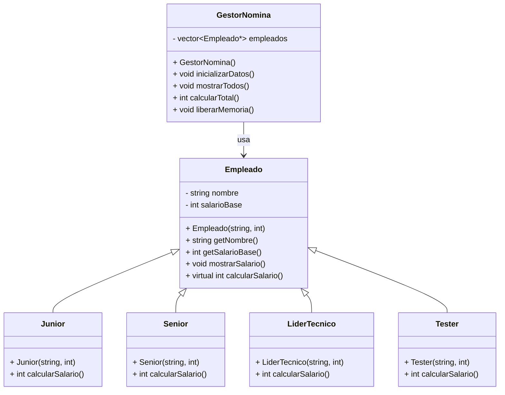

## Diagrama UML — Sistema de Nómina

```mermaid
classDiagram
    Empleado <|-- Junior
    Empleado <|-- Senior
    Empleado <|-- LiderTecnico
    Empleado <|-- Tester
    GestorNomina --> Empleado : usa


    class Empleado {
        - string nombre
        - int salarioBase
        + Empleado(string, int)
        + string getNombre()
        + int getSalarioBase()
        + void mostrarSalario()
        + virtual int calcularSalario()
    }

    class Junior {
        + Junior(string, int)
        + int calcularSalario()
    }

    class Senior {
        + Senior(string, int)
        + int calcularSalario()
    }

    class LiderTecnico {
        + LiderTecnico(string, int)
        + int calcularSalario()
    }

    class Tester {
        + Tester(string, int)
        + int calcularSalario()
    }

    class GestorNomina {
        - vector~Empleado*~ empleados
        + GestorNomina()
        + void inicializarDatos()
        + void mostrarTodos()
        + int calcularTotal()
        + void liberarMemoria()
    }
```